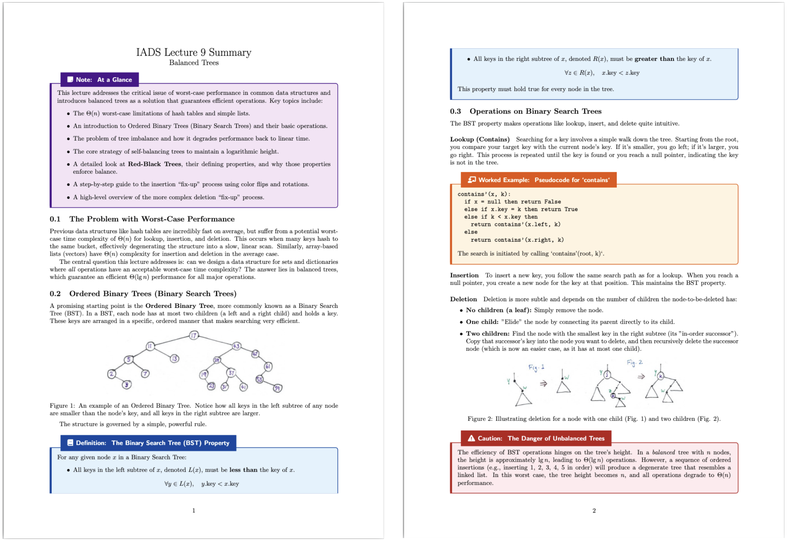

# LeQture (Browser Extension for Echo360 & YouTube)

LeQture isn’t **just another AI tool** tacked onto videos. It’s built around how students actually study. It sits on **Echo360** and **YouTube**, understands your **slides + transcript**, and turns a lecture into **answers with timestamps**, **smart quizzes**, **flashcards**, **summaries**, and an **interactive checklist**.
Its **unique** parts are explained under **Main features**.

---

## 🌐 Works with

* **Echo360** (slides + video frames + audio transcript)
* **YouTube** (video processing (automatic) + video frames + audio transcripts)

---

## 🎯 What it is

* A light, easy-to-use extension for learning **during** and **after** a lecture.
* Answers are **grounded** in the real content: you get **timestamps** and **slide references** you can jump to.
* Everything (**quizzes, flashcards, summaries, checklists**) is built from the actual **lecture material** (not generic internet text).

---

## 🧩 Main features (why it’s different)

### 1) Ask questions while watching

* Type a question with the lecture playing/paused.
* Get an answer with **timestamp + slide reference** so you can rewatch the exact bit and cross-verify information to detect hallucination.
* Built-in **safeguards** keep answers tied to the lecture.

**What’s unique?**
Unlike generic chat helpers, LeQture **always cites the exact place** in the lecture (time/slide), so you can verify fast.

---

### 2) Quiz generation  **10 question types** (expandable)

Not just MCQs. Out of the box you get:

1. Fill in the Blank
2. Multiple Choice
3. True or False
4. Check All That Apply (Multi-select)
5. Drag and Drop
6. Matching
7. Ordering / Sequencing
8. Identify the Incorrect Step
9. Debate / Stance Question
10. Mixed Fill-in (multi-blank)

> The quiz system is modular, so **new types** can be plugged in later.

**What’s unique?**
Unlike many AI tools you come across, LeQture **doesn’t stop at MCQs**. You get **10 varied formats** that test understanding, not just recall, and **hints** can include **timestamps/slides** so you can check the source.

**AI Marking and end-of-quiz feedback**

* **Auto-marking** for your attempts.
* **Side-by-side comparison** shows **your answer vs. an ideal answer**, with quick notes on what to improve.

**What’s unique?**
You don’t just get a score, you see **exactly what to fix**, aligned to the lecture.

---

### 4) Flashcards (Overleaf export + smarter self-testing)

* Make **flashcards** straight from the lecture.
* **Export to Overleaf** (LaTeX) for clean, printable sets.
* During self-testing, answers are **paraphrased** so you recall by **understanding**, not by memorising exact wording.

**What’s unique?**
Paraphrased answers reduce **subconscious memorisation**, so your score reflects **true performance**.

---

### 5) Interactive checklist (with “where was this covered?”)

* Auto-creates a **checklist** of key ideas from the lecture.
* **Tick off** items as you learn them.
* If you forget where something was taught, click **?** and it shows **the exact slide/time** in the video.

**What’s unique?**
No more scrubbing around. You can **ask where each checklist item was covered** and jump there instantly, saving a lot of time.

---

### 6) Summaries  **HTML or LaTeX**, highly customisable

* Build **study summaries** the way you like (sections, bullet depth, examples, etc.).
* **Slide images** are **embedded** in both **LaTeX** and **HTML** (works whether your slide PDF is **flattened or unflattened**).
* **HTML summaries** are **interactive**:

  * **Select text** to ask for clarification.
  * **Text-to-Speech** to listen to the summary.
* Visually engaging layout for quick scanning and revision.

**What’s unique?**
Unlike generic summaries you may have seen, LeQture’s are **visually engaging** and go further with **image embedding** (flattened or not), a feature **exclusive to LeQture**.

---

### 7) Hallucination safeguards (grounded by design)

* **LLM answers cite timestamps/slides.**
* **Quiz hints also cite timestamps/slides**, and you’re encouraged to double-check if something feels off.
* **Auto-retry** if the model returns **malformed JSON** (a common drift sign).
* **Image embedding for summaries** uses a special pipeline that **avoids sending all images to the LLM**, cutting context size and reducing hallucinations.
* **Slide-Context control**: intelligently **trims and groups relevant context** so the model sees **only what matters**, lowering error rates.
* …and more small checks to keep outputs faithful to the lecture.

---

### 8) Accessibility (toggle in Settings)

* **Increase font size**
* **High-contrast mode**
* **Transparency toggle** (for overlays)
* **Colour-blind mode** (prompts the AI not to rely on colour-only descriptions)
* **Reduced motion** (pauses/limits animations)
* **Full keyboard navigation**
* **Text-to-Speech** inside HTML summaries

---

## ⚙️ Simple “How it works”

1. Open a lecture on **Echo360** or **YouTube**.
2. The extension automatically processes the necessary information.
3. When you ask a question, it searches the **relevant parts** and gives a **grounded** answer with **timestamp/slide**.
4. From that same material, it builds **quizzes**, **flashcards**, **summaries**, and a **checklist**.

---

## 📜 License

**Copyright © 2025 SG-Project-Confidential.**

A **limited, revocable, non-exclusive license** is granted to **clone, compile, and run** the Software **in unmodified form for personal, non-commercial evaluation only**.
All other rights are reserved. **No modification, redistribution, or commercial/prod use.**
See the full terms in **[LICENSE](./LICENSE)**.
